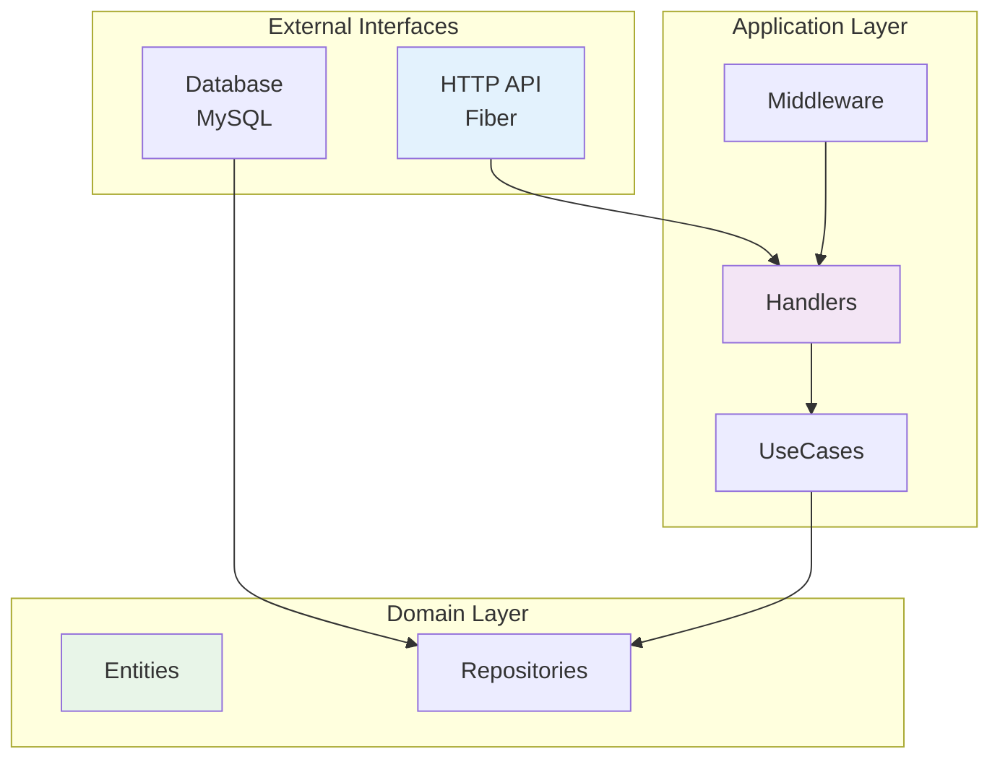
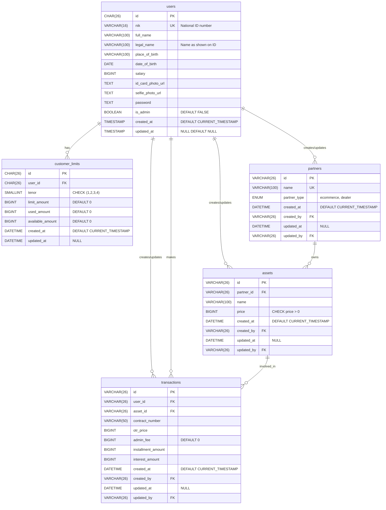

# Loan APP Api

A secure backend application for loan management built with **Golang (Fiber Framework)** and **MySQL**. Features include loan applications, admin approvals, and user management with OWASP Top 10-compliant security layers.

## 📋 Table of Contents

- [🏗️ Architecture Overview](#architecture-overview)
- [📁 Entity RelationShip Diagram](#erd-overview)
- [🔒 Security Features (OWASP Top 10)](#security-features-owasp-top-10)
- [🔌 API Endpoints](#api-endpoints)
- [🚀 Setup Instructions](#setup-instructions)


## 🏗️ Architecture Overview 

### System Architecture


### Project Structure

```
loan-app/
├── cmd/                    # Application entry point
│   └── main.go            # Main application bootstrap
├── config/                 # Configuration management
│   ├── config.go          # Configuration loader
│   ├── config.json        # Application configuration
│   └── types.go           # Configuration types
├── internal/              # Internal application code
│   ├── app/              # Application bootstrap
│   ├── entity/           # Domain entities/models
│   ├── handler/          # HTTP request handlers
│   ├── middleware/       # Custom middleware
│   ├── model/            # Request/response models
│   ├── repository/       # Data access layer
│   ├── route/            # Route definitions
│   ├── usecase/          # Business logic layer
│   ├── utils/            # Utility functions
│   └── vm/               # View models
├── pkg/                   # Reusable packages
│   ├── database/         # Database utilities
│   ├── fiber/            # Fiber framework setup
│   ├── logger/           # Logging utilities
│   ├── middleware/       # Common middleware
│   └── validator/        # Validation utilities
├── docs/                  # Documentation
│   └── postman/          # Postman collections
├── go.mod                 # Go module definition
├── go.sum                 # Go module checksums
├── Makefile              # Build and deployment scripts
└── README.md             # Project documentation
```

## 📁 Erd Overview



## 🔒 Security Features (OWASP Top 10)

This application has implemented several security features to protect against common attacks, including:

### Prevention of SQL Injection (OWASP A03)

* Use of prepared statements or parameterized queries to prevent SQL injection
* Use of a secure template engine to prevent template injection

### Prevention of Broken Authentication (OWASP A07)

* Implementation of authentication using JSON Web Tokens (JWT) to ensure secure data transmission
* Use of secure password hashing to store user passwords

### Security Misconfiguration Prevention (OWASP A05)

* Use of secure configuration for the application, including CORS and CSRF settings
* Use of the latest library and framework versions to ensure security

### Prevention of Insecure Direct Object References (IDOR) (OWASP A01)

* Implementation of role-based access control to ensure that only authorized users can access certain data
* Use of middleware to check user roles before accessing data

### Prevention of Cross-Site Request Forgery (CSRF) (OWASP A01)

* Implementation of CSRF tokens to ensure that requests sent by users are valid
* Use of middleware to check CSRF tokens before processing requests

### Prevention of API Security Risks (OWASP API Top 10) (Bonus for API)

* Implementation of JWT (JSON Web Tokens) to ensure secure data transmission
* Use of an API gateway to ensure security and access control to the API

## 🔌 API Endpoints

### Auth Endpoints

* `POST /v1/auth/sign-in`: Sign in user
* `POST /v1/auth/sign-up`: Sign up user

### User Endpoints

* `GET /v1/user/me`: Get self user information
* `GET /v1/user/limit`: Get user limits

### Partner Endpoints

* `POST /v1/partner`: Create partner
* `GET /v1/partner`: Get partner lists

### Asset Endpoints

* `POST /v1/asset`: Create asset
* `GET /v1/asset`: Get asset lists

### Transaction Endpoints

* `POST /v1/transaction`: Create User Transaction
* `GET /v1/transaction`: Get List User Transaction

### Swagger Endpoints

* `GET /swagger/*`: Swagger documentation

### 🔄 API Versioning

The API uses URL versioning (`/v1/`) to ensure backward compatibility. When making breaking changes, create a new version while maintaining the old one for a transition period.

## 🚀 Setup Instructions

### Prerequisites
- Go 1.24.2 or higher
- MySQL
- Make (for build automation)

### Installation

1. **Clone the repository**
```bash
git clone <repository-url>
cd loan-app
```

2. **Install dependencies**
```bash
go mod download
```

3. **Configure the application**

modify the configuration on `config/config.json`


4. **Set up the database**
```bash
# Run database migrations
make migrate-up
```

5. **Build and run the application**
```bash
# Development mode with hot reload
make run-dev

# Production mode
make run
```

### Available Make Commands

```bash
# Database migrations
make migrate-create name=<migration_name>  # Create new migration
make migrate-up                            # Apply migrations
make migrate-down                          # Rollback last migration
make migrate-clean                         # Rollback all migrations
make migrate-status                        # Show migration status

# Build and run
make build                                 # Build the application
make run-dev                               # Run with hot reload
make run                                   # Run in production mode
make clean                                 # Clean build artifacts
make rebuild                               # Force rebuild

# Swagger documentation
make swagger-gen                           # Generate Swagger documentation
make swagger-serve                         # Serve Swagger UI (requires server running)

# Help
make help                                  # Show all available commands
```

### Development Workflow

1. **Create a new feature branch**
```bash
git checkout -b feature/your-feature-name
```

2. **Make your changes and test**
```bash
make run-dev
```

3. **Create database migration if needed**
```bash
make migrate-create name=add_new_table
```

4. **Run tests and build**
```bash
make build
```

5. **Commit and push your changes**
```bash
git add .
git commit -m "feat(<module>): add new feature"
git push origin feature/your-feature-name
```